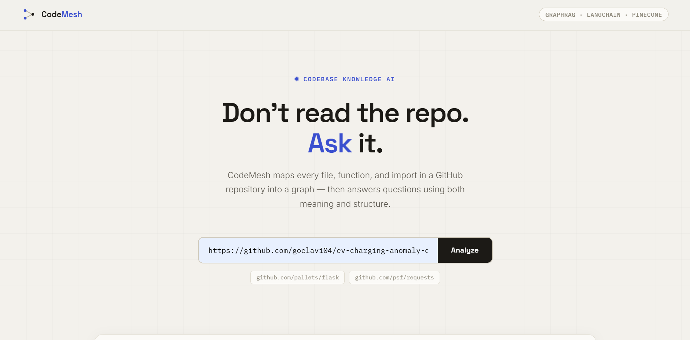
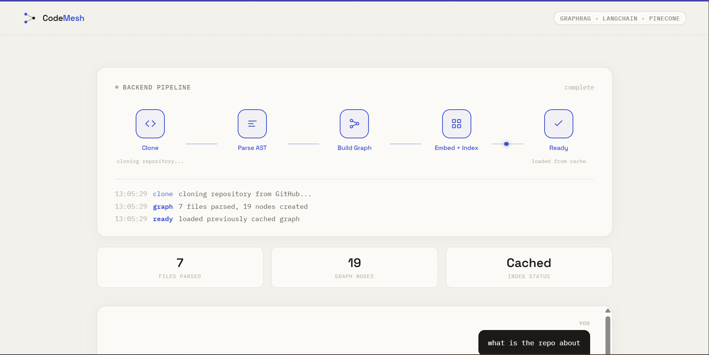
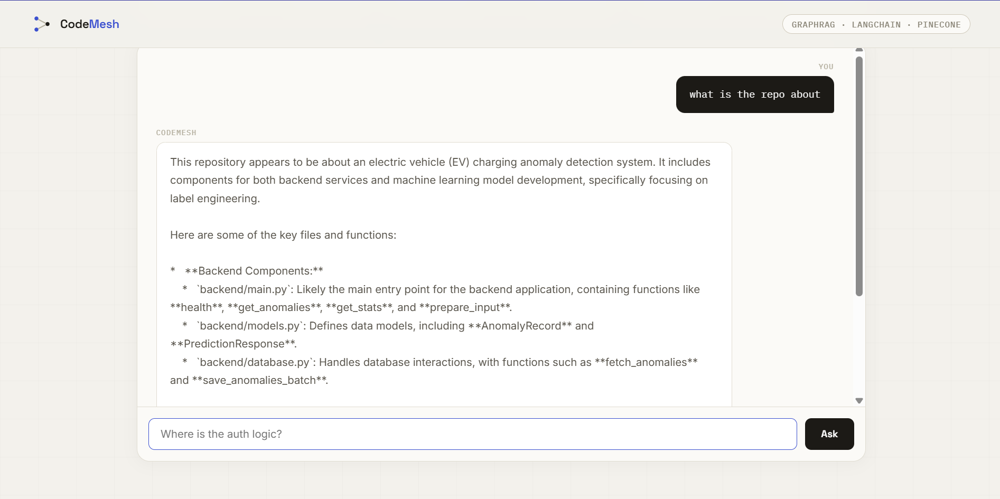

# CodeMesh — Codebase Knowledge AI

> Point it at any GitHub repository. It maps every file, function, and import into a graph — then answers questions about the codebase using both meaning and structure.



---

## Overview

CodeMesh is a **GraphRAG** system for source code — it goes beyond traditional document Q&A by understanding not just *what* a piece of code says, but *how it connects* to the rest of the codebase. Ask it "Where is the auth logic?" or "What does this repo do?" and it answers using a combination of semantic search and structural graph traversal, grounded in the actual files and functions of the repository.

Built as an advanced project in the **AI Mastery Roadmap**, this is a genuinely novel application of RAG — most RAG systems treat content as independent text chunks, but code is fundamentally relational. A function's meaning is incomplete without knowing what calls it and what it depends on. CodeMesh captures both dimensions.

---

## Why GraphRAG Instead of Standard RAG?

Standard RAG (vector search over text chunks) works well for documents, but code has a property documents don't: **deep structural interdependency**. A function in `auth.py` might be called from `routes.py`, which imports from `models.py`. Searching by text similarity alone misses this entirely — you might find `login()` but have no idea that `handle_login()` elsewhere depends on it.

CodeMesh builds **two indexes together**:

- A **vector index** (Pinecone) — for semantic search: "find code about authentication," even if the code never says the word "authentication"
- A **graph index** (NetworkX) — for structural search: "what does this function call, what calls it, what file is it defined in"

When a question comes in, both are used together — vector search finds the most relevant starting points, then graph traversal pulls in everything structurally connected to those points, before the LLM ever sees the question.

---

## How It Works — Architecture & Flow

```
                         ┌──────────────────────────┐
                         │   GitHub Repository URL    │
                         └────────────┬─────────────┘
                                      │
                                      ▼
                         ┌──────────────────────────┐
                         │   POST /analyze            │
                         └────────────┬─────────────┘
                                      │
            ┌─────────────────────────┼─────────────────────────┐
            │                         │                         │
            ▼                         ▼                         ▼
  ┌──────────────────┐    ┌──────────────────────┐   ┌─────────────────────┐
  │   1. CLONE          │    │   2. PARSE (AST)       │   │   3. BUILD GRAPH       │
  │                    │    │                      │   │                     │
  │  GitPython clones   │──▶│  Python ast module      │──▶│  NetworkX DiGraph     │
  │  the repo locally     │    │  walks every .py file  │   │                     │
  │                    │    │  extracts:             │   │  Nodes: files,        │
  │                    │    │  - imports             │   │  functions, classes   │
  │                    │    │  - functions + calls    │   │  Edges: imports,      │
  │                    │    │  - classes + methods    │   │  calls, defined_in    │
  └──────────────────┘    └──────────────────────┘   └──────────┬──────────┘
                                                                  │
                                                       ┌──────────┴──────────┐
                                                       │   Persisted to disk    │
                                                       │   as graph.pickle      │
                                                       │   (repo_cache/)        │
                                                       └──────────┬──────────┘
                                                                  │
                                                                  ▼
                                                       ┌─────────────────────┐
                                                       │  4. EMBED + INDEX     │
                                                       │                     │
                                                       │  sentence-           │
                                                       │  transformers          │
                                                       │  (all-MiniLM-L6-v2)    │
                                                       │                     │
                                                       │  Pinecone, namespaced  │
                                                       │  per repo               │
                                                       └─────────────────────┘
                                                                  │
                                                                  ▼
                                                       ┌─────────────────────┐
                                                       │   Repo Ready           │
                                                       │   (file/node counts)    │
                                                       └─────────────────────┘


                         ┌──────────────────────────┐
                         │   User asks a question      │
                         └────────────┬─────────────┘
                                      │
                                      ▼
                         ┌──────────────────────────┐
                         │   POST /ask                 │
                         └────────────┬─────────────┘
                                      │
                                      ▼
                  ┌────────────────────────────────────┐
                  │      HYBRID GRAPHRAG RETRIEVAL        │
                  │                                    │
                  │  Step 1 — Vector Search               │
                  │  Pinecone returns top-K semantically  │
                  │  similar functions/classes            │
                  │  (K=5 normally, K=20 for summary       │
                  │   style questions)                    │
                  │                                    │
                  │  Step 2 — Graph Traversal             │
                  │  For each result, NetworkX finds       │
                  │  directly connected nodes —            │
                  │  callers, callees, parent file         │
                  │                                    │
                  │  Step 3 — Context Assembly             │
                  │  All nodes deduplicated and combined   │
                  │  into one context block                │
                  └────────────────┬───────────────────┘
                                   │
                                   ▼
                         ┌──────────────────────────┐
                         │   LLM (OpenRouter)          │
                         │   generates grounded,         │
                         │   structured answer            │
                         │   citing real file/function    │
                         │   names from the context        │
                         └────────────┬─────────────┘
                                      │
                                      ▼
                         ┌──────────────────────────┐
                         │   JSON response → Frontend  │
                         │   (answer + sources)          │
                         └──────────────────────────┘
```

### Why two passes when building the graph

The graph is built in two passes over the parsed files:

1. **Pass 1 — Create nodes.** Every file, function, and class becomes a node.
2. **Pass 2 — Create edges.** Only after all nodes exist do we link them — `imports` edges between files, `calls` edges between functions, `defined_in` edges linking functions/classes to their file.

This two-pass approach is necessary because a function's call edge might point to a function defined in a file we haven't processed yet — all nodes need to exist before any edges can be safely drawn.

---

## Screenshots

### Landing Page


### Live Backend Pipeline Visualizer


### Chat-Style Q&A with Grounded Answers


---

## Features

- Analyze any public GitHub repository by URL
- Live visual pipeline showing Clone → Parse AST → Build Graph → Embed + Index → Ready
- Persistent caching — re-analyzing the same repo loads instantly from disk instead of re-cloning and re-indexing
- Chat-style Q&A interface for asking multiple questions about the same repo
- Hybrid retrieval — combines Pinecone vector search with NetworkX graph traversal
- Adaptive retrieval width — broad context for "summarize this repo" questions, narrow and precise for "where is X" questions
- Structured, formatted answers with bolded file/function names and bullet points
- Honest fallback — the LLM is explicitly instructed to say when context is insufficient rather than guess
- Source citations under every answer showing which functions/files were used

---

## Tech Stack

| Layer | Technology | Purpose |
|---|---|---|
| Repo Cloning | `GitPython` | Clones any public GitHub repo locally for parsing |
| Code Parsing | Python `ast` (built-in) | Extracts functions, classes, imports, and function calls without regex |
| Graph | `NetworkX` + `pickle` | Represents code relationships as a directed graph, persisted to disk |
| Embeddings | `sentence-transformers` (`all-MiniLM-L6-v2`) | Converts functions/classes into 384-dim vectors for semantic search |
| Vector Store | `Pinecone` (namespaced per repo) | Stores and searches embeddings at scale |
| LLM | `OpenRouter` (`openrouter/auto`) | Generates the final grounded answer from retrieved context |
| Backend | `FastAPI` | Exposes `/analyze` and `/ask` endpoints |
| Frontend | HTML / CSS / JS | Repo input, live pipeline visualizer, chat-style Q&A |

---

## Project Structure

```
codebase-knowledge-ai/
│
├── main.py              # FastAPI app — /analyze and /ask endpoints, session + disk caching
├── repo_parser.py        # Clones repos and parses Python files via ast
├── graph_builder.py      # Builds the NetworkX graph, handles save/load persistence
├── indexer.py            # Embeds nodes and manages the Pinecone index per repo
├── retriever.py          # Hybrid GraphRAG retrieval + LLM answer generation
│
├── static/
│   └── index.html        # Frontend — repo input, pipeline visualizer, chat UI
│
├── repo_cache/           # Persisted graphs + metadata per repo (not committed)
├── cloned_repos/         # Cloned repo source code (not committed)
├── screenshots/          # README screenshots
├── .env                  # API keys (not committed)
├── .gitignore
└── README.md
```

---

## Getting Started

### Prerequisites

- Python 3.10+
- A free [Pinecone](https://pinecone.io) API key
- A free [OpenRouter](https://openrouter.ai) API key
- Git installed and available on your system PATH

### Installation

```bash
git clone https://github.com/goelavi04/codebase-knowledge-ai.git
cd codebase-knowledge-ai

python -m venv venv
venv\Scripts\activate        # Windows
source venv/bin/activate     # macOS / Linux

pip install fastapi uvicorn gitpython networkx sentence-transformers pinecone requests python-dotenv
```

### Configuration

Create a `.env` file in the root directory:

```
PINECONE_API_KEY=your_pinecone_key_here
OPENROUTER_API_KEY=your_openrouter_key_here
```

### Running the App

```bash
python -m uvicorn main:app --reload
```

Open your browser and navigate to:

```
http://localhost:8000
```

---

## Usage

1. Paste a public GitHub repository URL (Python repos work best) into the input field
2. Click **Analyze** and watch the live pipeline visualizer move through each stage
3. Once indexing completes, the chat interface appears below
4. Ask questions like:
   - *"What is this repo about?"*
   - *"Where is the database logic?"*
   - *"What does the `main.py` file depend on?"*
5. Each answer includes source tags showing which functions/files were used to generate it

> **Note:** This project currently focuses on Python repositories. Non-Python files are skipped during parsing.

---

## API Reference

### `POST /analyze`

Clones, parses, and indexes a GitHub repository. If the repo was previously analyzed, loads from disk cache instead of repeating the full pipeline.

**Request body:**
```json
{
  "repo_url": "https://github.com/owner/repository"
}
```

**Response:**
```json
{
  "repo_name": "repository",
  "status": "newly_analyzed",
  "file_count": 7,
  "node_count": 19,
  "vector_count": 14
}
```

### `POST /ask`

Asks a question about a previously analyzed repository using hybrid GraphRAG retrieval.

**Request body:**
```json
{
  "repo_name": "repository",
  "question": "Where is the auth logic?"
}
```

**Response:**
```json
{
  "answer": "The authentication logic is primarily in **auth.py**...",
  "sources": [
    { "node_id": "auth.py::login", "name": "login", "type": "function", "score": 0.81 }
  ],
  "nodes_explored": 12
}
```

**Error responses:**
- `400` — No Python files found, or repo not yet analyzed and not cached on disk
- `500` — Internal server error (cloning, parsing, or LLM failure)

---

## Dependencies

```
fastapi
uvicorn
gitpython
networkx
sentence-transformers
pinecone
requests
python-dotenv
```

---

## Known Limitations

- Python repositories only — other languages are not parsed
- Function call resolution is name-based, not fully scope-aware, so two functions with the same name in different classes can occasionally be conflated
- Large repositories (1000+ files) will take significantly longer to clone, parse, and embed on first analysis
- The in-memory session cache resets on server restart, but automatically recovers from the on-disk graph cache without requiring a full re-analysis

---

## Future Improvements

- Support additional languages (JavaScript, TypeScript) using language-specific parsers
- Add scope-aware call resolution to reduce name-collision ambiguity
- Stream the `/analyze` pipeline stages to the frontend in real time via WebSockets instead of simulated timing
- Allow incremental re-indexing when only specific files in a repo change

---

## Author

**Aviral Goel** — [github.com/goelavi04](https://github.com/goelavi04)
